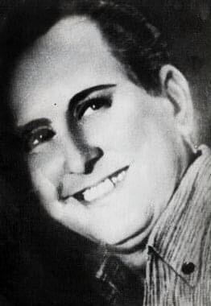
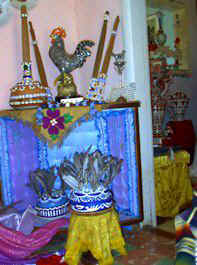
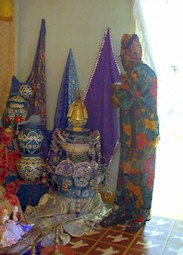

**Oshúnyemí, Olo Oshun**

Rigoberto Rodriguez Duque, Oshunyemi also lived in Madruga and was one of the true greats of the religion and was a pioneer for re-linking Cuba to Africa. He was the first Cuban-born Olosha to travel to Nigeria, bringing back with him much knowledge as well as several indispensable ingredients that had been either nonexistent or in short supply in Cuba. He brought the first African Grey parrot to Cuba. Prior to that, Cuban Oloshas would dye pigeon feathers with mercurochrome to simulate the African Grey's tail feathers, which are used for many purposes in the religion, the most important being the crowning of the Iyawo on the middle day of the initiation.

Rigoberto is said to have initiated between 400 and 500 Oloshas. He was the recipient of tremendous ire from the Orishas, winning the Puerto Rican lottery six times. For this he rewarded Shango with a solid gold pilon. His Orisha shrines were so elaborate and beautiful that rather than be dismantled upon his death, they serve as a centerpiece at the Afro Cuban museum that is now housed in his former home. His widow, Fredesvinda Rosel, Oyayemi, attends the museum. In addition to being his widow, she was also his goddaughter. Both Rigoberto and Freddie, as Fredesvinda was called, were gay and to avoid the 'reeducation camps' Castro had in place, they married and lived platonically.

Rigoberto was renowned for mounting an incredible Oshun. Jimagua described her as 'the most splendorous Oshun who ever descended to Earth'. Her predictions, prescriptions, and afudashe were unmatched.

There are stories from Arturo Sardina, Olomidara that it was not uncommon for Rigoberto to initiate three and four people at a time. One initiation an Ogun, Yemoja, Shango, and Oshun were all being simultaneously initiated and all became possessed at once.
One well-known event witnessed by many Oloshas in Cuba is telling of Rigoberto's ashe, which concerns his death and funeral rites. When an Olosha dies, an elder Oriate does a ceremony called itutu that determines what happens to the priests Orisha. Rigoberto gathered his godchildren togther and performed his own itutu then quietly passed away.

Source originally from `http://www.yemoja.com/discussion/disc1/000000c3.htm` accessed on 1/19/2001. [Click to download PDF.](../lineage/rama.pdf)

  

    

 
Rigoberto Rodriguez, ibae

    

 
Rigoberto Rodriguez, orisha

    

 
Rigoberto Rodriguez yemoja - This is his widow in the pic, she maintains his house as a museum.

  

  

  

